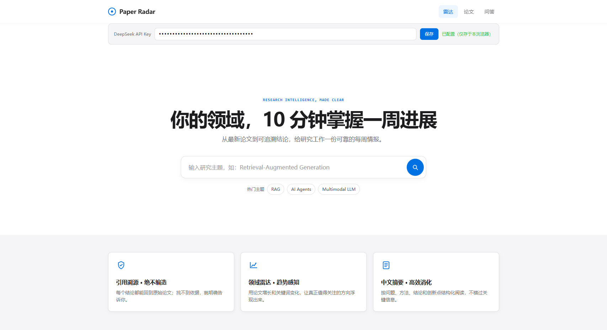
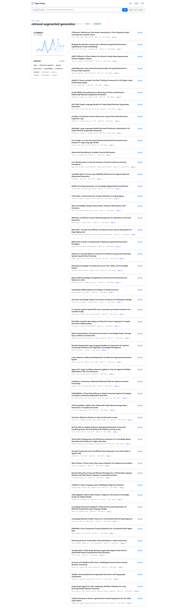

# Paper Radar · 论文情报雷达

> Research intelligence, made clear.

**Paper Radar** 是一个论文情报 Agent：输入研究主题，10 分钟掌握该领域一周进展。面向需要持续追踪前沿论文的研究者、工程师与产品经理。

核心差异化：**引用溯源防编造**——所有回答必须附来源论文，检索不到就明确告知，绝不编造。




## ✨ 功能特性

| 能力 | 说明 |
|---|---|
| 📡 **领域雷达** | 自动扫描 arXiv 近 30 天论文，输出数量趋势图与高频关键词云，30 秒判断领域冷热 |
| 📄 **中文结构化摘要** | 每篇论文自动生成「问题 / 方法 / 结论 / 创新点」四段式中文摘要，无需阅读英文原文 |
| 💬 **深度问答（引用溯源）** | 基于向量检索的 RAG 问答，每个关键结论附 `[n]` 引用角标 + arXiv 来源链接 |
| 🔗 **相关文献推荐** | 基于语义相似度推荐同领域论文，一键跳转 arXiv 原文 |
| 🔒 **无来源不回答** | 检索相似度低于阈值时明确拒绝回答，从机制上杜绝幻觉与编造 |

## 🚀 在线体验

**https://paper-radar.w3118597378.workers.dev**

- 打开即用：输入主题即可生成领域雷达（无需任何配置）
- 摘要 / 问答 / 文献推荐：在页面顶部填入自己的 DeepSeek API Key（**仅存于浏览器 localStorage，不上传任何服务器**）
- 模型（bge-small-zh）与前端同域托管，首次加载约 1~3 秒

> 为什么不内置 key？本项目为开源演示，不持有任何用户的 API 密钥。所有 LLM 调用均由访问者浏览器直连 DeepSeek 官方 API，代码里零密钥、零后端存储。

## 🏗 架构

纯浏览器端 RAG，零后端服务：

```
┌─────────────────────────── 浏览器 (GitHub Pages / Cloudflare Workers 静态托管) ───────────────────────────┐
│                                                                                                             │
│  index.html                                                                                                 │
│  ├─ fetch /api/arxiv ──────────────► Cloudflare Worker 代理 ──► arXiv API（真实论文数据）                    │
│  ├─ Transformers.js 加载 bge-small-zh ──► 本地向量化（512 维，同域模型文件，无 CORS 问题）                    │
│  ├─ JS 余弦相似度检索 ──► top-k 相关论文                                                                     │
│  └─ fetch api.deepseek.com ────────► 用户自填 key（localStorage）─► 摘要 / 问答生成                          │
│                                                                                                             │
└─────────────────────────────────────────────────────────────────────────────────────────────────────────────┘
```

**设计要点：**

- **零后端**：arXiv 经 Cloudflare Worker 代理（10 行代码，无密钥）；embedding 在访问者浏览器本地运行；LLM 由用户 key 直连
- **零成本**：Cloudflare Workers 免费层 + arXiv 免费 API + 浏览器本地计算，月成本 ≈ 0（不含用户自用 LLM 额度）
- **隐私优先**：无账号、无服务器存储、key 不上传

## 🛠 技术栈

| 层 | 技术 | 说明 |
|---|---|---|
| 前端 | 原生 HTML/CSS/JS | 单文件应用，苹果白设计（DESIGN.md 定案） |
| 数据源 | arXiv API | 免费、无 key、Atom XML 格式 |
| Embedding | bge-small-zh-v1.5 (ONNX q8) | 512 维，经 Transformers.js 在浏览器运行 |
| 向量检索 | JS 余弦相似度 | 50 篇论文毫秒级检索 |
| LLM | DeepSeek API | OpenAI 兼容，浏览器 CORS 直连 |
| 部署 | Cloudflare Workers + Assets | 静态托管 + 函数代理，`wrangler deploy` 一键发布 |

## 📦 本地运行（开发）

### 前置

- Python 3.12 + uv（仅数据管道需要）
- 可选：本地 embedding 模型 `E:\models\bge-small-zh-v1.5`

### 方式一：纯浏览器（无需 Python）

```bash
# 1. 本地起静态服务（模拟 Cloudflare 部署环境）
cd public
python -m http.server 8899
# 2. 浏览器打开 http://127.0.0.1:8899
# 3. 注意：纯静态服务下 /api/arxiv 代理不可用，请用 wrangler dev（见方式三）
```

### 方式二：完整数据管道（Python）

```bash
cd E:\paper-radar
unset PYTHONPATH                    # Windows: 清除 Hermes 终端注入的 PYTHONPATH
uv venv .venv --python 3.12
uv pip install --index-url https://mirrors.aliyun.com/pypi/simple/ -r requirements.txt
# 配置 .env：DEEPSEEK_API_KEY=sk-...
export HF_HUB_DISABLE_SYMLINKS_WARNING=1
uv run python -m app.pipeline "retrieval augmented generation" 30 100
```

### 方式三：本地开发服务器（模拟线上完整环境）

```bash
cd E:\paper-radar
python dev_server.py 8899    # 静态文件 + /api/arxiv 代理（模拟 Worker）
# 浏览器打开 http://127.0.0.1:8899
```

## 📁 项目结构

```
paper-radar/
├── public/
│   ├── index.html            # 前端应用（浏览器端 RAG 全链路）
│   └── models/               # bge-small-zh-v1.5 ONNX 模型（同域托管，免 CORS）
├── worker.js                 # Cloudflare Worker 入口（/api/arxiv 代理）
├── wrangler.toml             # Cloudflare 部署配置
├── app/                      # Python 数据管道（本地可选）
│   ├── arxiv_fetcher.py      #   arXiv 拉取（https + 重试 + 缓存）
│   ├── embedder.py           #   chunk + bge 向量化 + ChromaDB 入库
│   ├── radar.py              #   趋势 / 关键词统计
│   ├── summarizer.py         #   deepseek 四段式摘要
│   ├── chat.py               #   RAG 问答（LLM 翻译 + 阈值拒答）
│   └── recommend.py          #   相关文献推荐
├── docs/
│   ├── PRD.md                # 产品需求文档
│   ├── DESIGN.md             # 设计定案（经典苹果白）
│   ├── TASKS.md              # 任务清单（T0~T3）
│   ├── DEMO.md               # 演示脚本
│   └── screenshots/          # README 配图
├── eval/                     # 20 问评测集 + 自动评测脚本
└── dev_server.py             # 本地开发服务器
```

## 📊 评测

基于 20 个问题（覆盖 3 个已入库主题 + 边界场景）的自动评测：

| 指标 | 结果 |
|---|---|
| 溯源率（回答附来源） | **16/16 (100%)** |
| 拒绝率（无据拒绝） | **3/3 + C4 (100%)** |
| 检索质量 | 中英语义检索命中 0.84 / 0.88 / 0.78 |

```bash
uv run python -m app.run_eval   # 自动评测，见 eval/test_set.md
```

## 🚢 部署

### Cloudflare Workers（当前线上方式）

```bash
# 前置：wrangler 已登录（wrangler login）
cd E:\paper-radar
wrangler deploy
# 输出：https://paper-radar.w3118597378.workers.dev
```

push 到 GitHub 后可在 Cloudflare Dashboard 关联仓库自动部署（Pages 模式）。

### 已退役：Streamlit Cloud

历史版本曾部署于 Streamlit Community Cloud（Python 全栈），因「零后端」演进方向退役。仓库保留 `app/` 目录，可随时 `uv run streamlit run app/app.py` 本地运行。

## 📚 文档

| 文档 | 内容 |
|---|---|
| [docs/PRD.md](docs/PRD.md) | 产品需求与验收标准 |
| [DESIGN.md](DESIGN.md) | 设计定案（配色 / 字体 / 组件 / 动效） |
| [docs/TASKS.md](docs/TASKS.md) | 开发任务清单（T0~T3） |
| [docs/DEMO.md](docs/DEMO.md) | 演示脚本 |
| [docs/NFR-ACCEPTANCE.md](docs/NFR-ACCEPTANCE.md) | 非功能验收记录 |

## 🔭 Roadmap

- [x] T0 环境准备 / M1 数据管道 / M2 核心功能 / M3 问答溯源（20/20 评测）
- [x] 线上部署（Cloudflare Workers，纯浏览器端）
- [ ] 每日推送订阅（v1.1）
- [ ] 收藏夹 / 论文标注（v1.1）
- [ ] 更多 embedding 模型选择（v1.1）

## ⚖️ License

MIT License. See [LICENSE](LICENSE).

---

*Paper Radar · 论文情报 Agent · 引用溯源，绝不编造*
